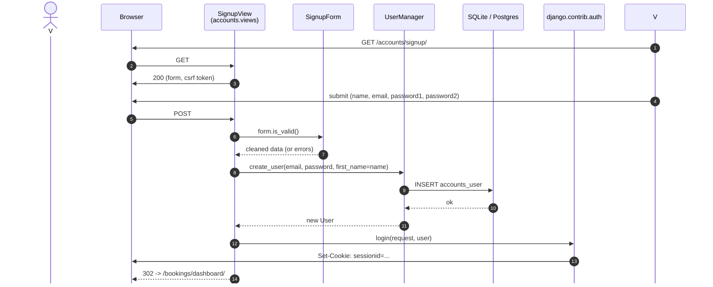
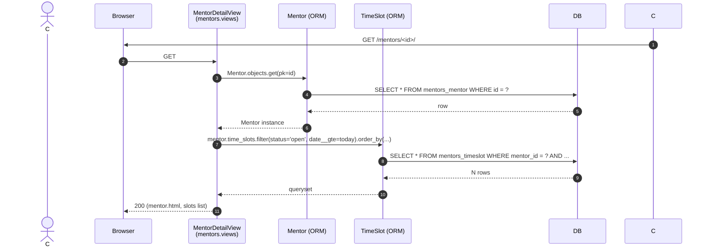
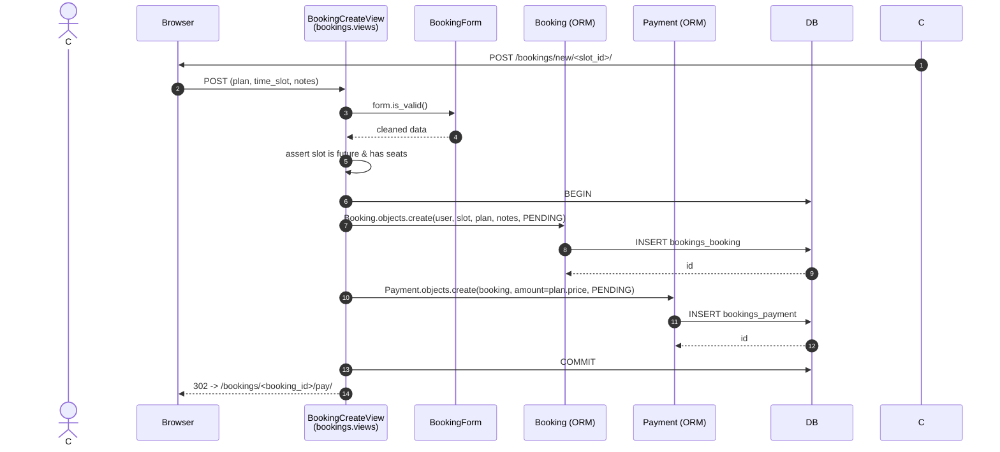
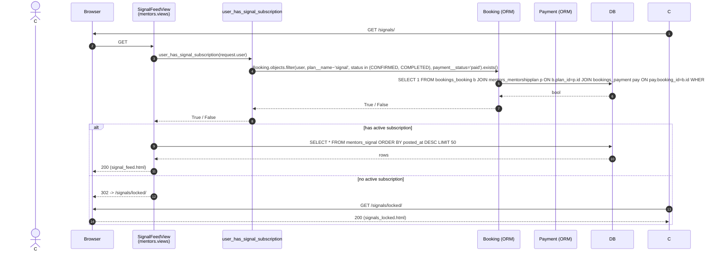
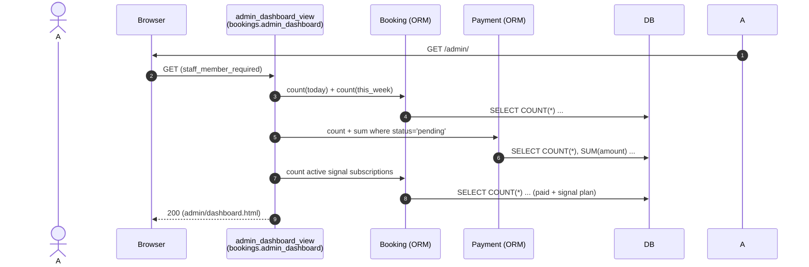

# CybergateFX &mdash; Sequence Diagrams &amp; Descriptions

Sequence diagrams focus on the *time-ordered message flow* between the
actors, the view layer, Django's URL/middleware stack, the ORM/models
and the database. Three key scenarios are covered:

1. **Sign up &rarr; auto-login** (UC-01)
2. **Browse &rarr; book &rarr; pay &rarr; confirmation** (UC-04, UC-05, UC-06, UC-07)
3. **Live signal feed with subscription gating** (UC-10, UC-11)

Diagrams are in Mermaid so they render natively on GitHub, GitLab and
most Markdown viewers. A textual trace that reads top-to-bottom follows
each diagram.

---

## 3.1 Sign up &rarr; auto-login

### Diagram



### Step-by-step description

1. The visitor opens the signup page in the browser. Django's
   `CsrfViewMiddleware` injects a token into the rendered form.
2. The visitor fills in **Full name**, **Email**, **Password**,
   **Confirm password** and submits.
3. `SignupView` (a class-based `CreateView`) delegates validation to
   `SignupForm`. The form checks that the email is unique and that
   both passwords match (Django's `UserCreationForm` does the heavy
   lifting).
4. On valid input, `SignupForm.save()` calls
   `UserManager._create_user`, which normalizes the email, sets
   `username = email`, hashes the password with PBKDF2, and inserts a
   new row into `accounts_user`.
5. `SignupView` then calls `django.contrib.auth.login()`, which writes a
   session row and tells the browser to set the `sessionid` cookie.
6. Finally the view returns `302 Location: /bookings/dashboard/`. The
   browser follows the redirect and the customer sees their dashboard.

### Why this matters

- The signup view is *transactional*: if either the `INSERT` or the
  `login()` step fails, no user appears in the database and the
  customer is shown an error.
- Because the user is logged in *during* the response cycle, the very
  first page they see after signing up is the dashboard &mdash; no
  extra click.

---

## 3.2 Browse &rarr; book &rarr; pay &rarr; confirmation

This is the longest end-to-end flow in the app and is split into three
sub-flows so the diagram stays readable.

### Sub-flow A &mdash; browse mentor + slot list



### Sub-flow B &mdash; book a session



### Sub-flow C &mdash; simulated pay &rarr; confirmation

```mermaid
%%{init: {'theme':'light'}}%%
sequenceDiagram
  autonumber
  actor Customer as C
  participant Browser
  participant PaymentView as PaymentView<br/>(bookings.views)
  participant SimulatedForm as SimulatedPaymentForm
  participant Payment as Payment (ORM)
  participant Booking as Booking (ORM)
  participant Confirmation as BookingConfirmationView
  participant DB

  C->>Browser: POST /bookings/<id>/pay/
  Browser->>PaymentView: POST (method, card_*)
  PaymentView->>SimulatedForm: form.is_valid()
  SimulatedForm-->>PaymentView: cleaned data
  PaymentView->>Payment: payment.mark_paid()
  Payment->>DB: UPDATE bookings_payment SET status='paid', paid_at=now WHERE id=?
  PaymentView->>Booking: booking.status = CONFIRMED; booking.save()
  Booking->>DB: UPDATE bookings_booking SET status='confirmed' WHERE id=?
  PaymentView-->>Browser: 302 -> /bookings/<id>/confirmation/
  C->>Browser: GET /bookings/<id>/confirmation/
  Browser->>Confirmation: GET
  Confirmation->>DB: SELECT booking + payment JOIN
  DB-->>Confirmation: row
  Confirmation-->>Browser: 200 (confirmation.html)
```

### Step-by-step description

- **Browse**: `MentorDetailView.get_context_data` runs two ORM queries
  &mdash; one for the mentor, one for `time_slots` &mdash; both using
  indexed lookups by primary key and the `mentor_id` foreign key.
- **Book**: `BookingCreateView` wraps the booking and payment creation
  in a `transaction.atomic()` block so we never end up with a booking
  but no payment (or vice versa). On success the customer is sent to
  the payment page for the freshly created booking.
- **Pay**: `PaymentView` calls `Payment.mark_paid()` (a model method
  that sets `status='paid'` and `paid_at=now()`) and flips the booking
  to `CONFIRMED`. Both rows are updated in two `UPDATE` statements.
- **Confirmation**: A simple read-only `DetailView` joins the booking
  and the related payment and renders the final receipt.

### Why this matters

- The booking step uses an atomic transaction, so a crash or error
  between "create booking" and "create payment" rolls back both
  inserts.
- Payment is a `OneToOneField` &mdash; the schema guarantees there is
  never more than one payment per booking.
- The simulated checkout never touches a real gateway; the *only*
  effect is two SQL `UPDATE` statements on the local DB.

---

## 3.3 Live signal feed (with subscription gating)



### Step-by-step description

1. The customer requests `/signals/`. Because this is a
   `LoginRequiredMixin`-protected view, anonymous visitors are already
   redirected to `/accounts/login/`.
2. `SignalFeedView.dispatch` calls the helper
   `user_has_signal_subscription(user)`. The helper runs a single SQL
   query that joins `bookings_booking` &rarr; `mentors_mentorshipplan`
   &rarr; `bookings_payment` and returns whether at least one row
   matches.
3. If the helper returns `True`, the view runs a second query for the
   50 most recent signals and renders `signal_feed.html`.
4. If the helper returns `False`, the view returns a 302 to
   `/signals/locked/`, where the customer is shown a callout with the
   Signal Subscription plan and a *View plans* button.

### Why this matters

- Gating is done at *query time*, not at template time. There is no way
  for a forbidden signal to leak into the HTML response.
- The helper uses `__` lookups to join through the ORM, so the query is
  a single SQL statement &mdash; no Python-level loops over bookings.

---

## 3.4 Cancel a booking (for completeness)

```mermaid
%%{init: {'theme':'light'}}%%
sequenceDiagram
  autonumber
  actor Customer as C
  participant Browser
  participant BookingCancel as BookingCancelView<br/>(bookings.views)
  participant Booking as Booking (ORM)
  participant Payment as Payment (ORM)
  participant DB

  C->>Browser: GET /bookings/<id>/cancel/
  Browser->>BookingCancel: GET
  BookingCancel->>DB: SELECT booking WHERE id=? AND user=?
  DB-->>BookingCancel: row
  BookingCancel-->>Browser: 200 (cancel.html)
  C->>Browser: POST /bookings/<id>/cancel/
  Browser->>BookingCancel: POST
  BookingCancel->>Booking: status='cancelled'; save()
  Booking->>DB: UPDATE bookings_booking
  BookingCancel->>Payment: status='refunded'; save()
  Payment->>DB: UPDATE bookings_payment
  BookingCancel-->>Browser: 302 -> /bookings/dashboard/
```

The cancel flow is intentionally short: two updates, one redirect. It
re-uses the same `Booking.objects.filter(user=...)` guard that the
payment and confirmation views use, so a customer cannot cancel another
customer's booking.

---

## 3.5 Admin dashboard



A single HTTP roundtrip, four `COUNT`/`SUM` queries, one render. There
is no caching, but the dashboard is staff-only and the data is bounded
by the size of the bookings table, so query cost is negligible.
