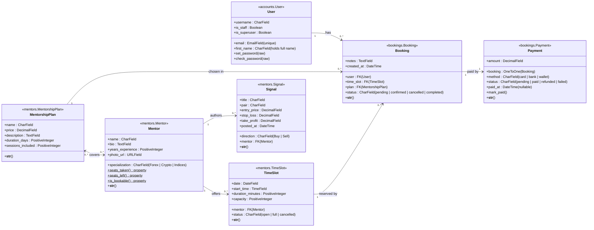

# CybergateFX &mdash; Class Diagram &amp; Description

This document captures the static structure of the system: the seven
persistent classes (Django models), their fields, methods, relationships
and multiplicities. The diagram is followed by per-class and
per-relationship explanations and a note on how the model layer maps to
the view layer (URLs, class-based views and forms).

---

## 1. Class diagram

Notation: a `()` after a method denotes an instance method, `()` after
a `$` denotes a Python `@property`. Foreign keys are drawn as plain
arrows; the multi-plicity at each end is the same as Django's
`on_delete` semantics (CASCADE for `Booking&harr;TimeSlot`,
`on_delete=PROTECT` for `Booking&harr;MentorshipPlan`).

---

## 2. Class catalogue

### 2.1 `accounts.User` (custom user model)

| Field            | Type           | Notes                                                                |
|------------------|----------------|----------------------------------------------------------------------|
| `email`          | `EmailField`   | **Unique**, used as the login identifier (`USERNAME_FIELD = 'email'`). |
| `username`       | `CharField`    | Kept equal to `email` so admin lookups and Django internals keep working. |
| `first_name`     | `CharField`    | Holds the *full* name (signup form has a single `name` field).       |
| `is_staff`       | `Boolean`      | True for admin users (gates `/admin/`).                              |
| `is_superuser`   | `Boolean`      | True for the admin seeded by the `seed` command.                     |

Inherits from `AbstractUser` and overrides `USERNAME_FIELD` /
`REQUIRED_FIELDS`. The companion `UserManager` exposes
`create_user` and `create_superuser`, both keyed on `email`.

### 2.2 `mentors.MentorshipPlan`

| Field              | Type                  | Notes                                |
|--------------------|-----------------------|--------------------------------------|
| `name`             | `CharField(80)`       | e.g. *1-on-1 Coaching*.              |
| `price`            | `DecimalField(8,2)`   | USD.                                 |
| `description`      | `TextField`           | Plain-text description shown on cards. |
| `duration_days`    | `PositiveInteger`     | Plan validity window after purchase. |
| `sessions_included`| `PositiveInteger`     | 0 for signal-only plans.             |

Default ordering: by `price` ascending.

### 2.3 `mentors.Mentor`

| Field             | Type                  | Notes                                |
|-------------------|-----------------------|--------------------------------------|
| `name`            | `CharField(120)`      | Display name.                        |
| `bio`             | `TextField`           | Long bio shown on the profile page.  |
| `years_experience`| `PositiveInteger`     |                                      |
| `specialization`  | `CharField` (choices) | `Forex`, `Crypto` or `Indices`.      |
| `photo_url`       | `URLField`            | External URL; no upload for now.     |
| `plans`           | M2M to `MentorshipPlan`| Plans the mentor is part of.        |

Computed properties:
- `seats_taken()` &mdash; count of `Booking` rows for any of this
  mentor's slots with status `pending` or `confirmed`.
- `seats_left()` &mdash; `capacity - seats_taken`, clamped to 0.
- `is_bookable()` &mdash; `True` iff `status == 'open'` and `seats_left > 0`.

### 2.4 `mentors.TimeSlot`

| Field             | Type                  | Notes                                |
|-------------------|-----------------------|--------------------------------------|
| `mentor`          | FK to `Mentor`        | `on_delete=CASCADE`.                 |
| `date`            | `DateField`           | Slot day.                            |
| `start_time`      | `TimeField`           | Slot start (UTC).                    |
| `duration_minutes`| `PositiveInteger`     | Default 60.                          |
| `capacity`        | `PositiveInteger`     | Default 1.                           |
| `status`          | `CharField` (choices) | `open`, `full`, `cancelled`.         |

Default ordering: `date, start_time`. The `seed` command generates the
next 4 weeks of slots following the Mon&ndash;Fri / Saturday pattern
(see README).

### 2.5 `bookings.Booking`

| Field         | Type                  | Notes                                       |
|---------------|-----------------------|---------------------------------------------|
| `user`        | FK to `User`          | `on_delete=CASCADE`.                        |
| `time_slot`   | FK to `TimeSlot`      | `on_delete=CASCADE`.                        |
| `plan`        | FK to `MentorshipPlan`| `on_delete=PROTECT` &mdash; can't delete a plan that has bookings. |
| `status`      | `CharField` (choices) | `pending`, `confirmed`, `cancelled`, `completed`. |
| `notes`       | `TextField` (blank)   | Customer note.                              |
| `created_at`  | `DateTime`            | Auto-set to `timezone.now`.                 |

Default ordering: `-created_at` (newest first).

### 2.6 `bookings.Payment`

| Field      | Type                  | Notes                                       |
|------------|-----------------------|---------------------------------------------|
| `booking`  | OneToOne to `Booking` | One payment per booking.                    |
| `amount`   | `DecimalField(8,2)`   | Mirrored from the booking's plan price.     |
| `method`   | `CharField` (choices) | `card`, `bank`, `wallet`.                   |
| `status`   | `CharField` (choices) | `pending`, `paid`, `refunded`, `failed`.    |
| `paid_at`  | `DateTime` (nullable) | Set by `mark_paid()`.                       |

Method:
- `mark_paid()` &mdash; sets `status='paid'` and `paid_at=now()`. This
  is the single mutation the simulated checkout performs.

### 2.7 `mentors.Signal`

| Field         | Type                  | Notes                                  |
|---------------|-----------------------|----------------------------------------|
| `title`       | `CharField(120)`      | Free-text headline.                    |
| `pair`        | `CharField(20)`       | e.g. `EUR/USD`, `BTC/USD`, `US500`.    |
| `direction`   | `CharField` (choices) | `Buy` or `Sell`.                       |
| `entry_price` | `DecimalField(12,5)`  |                                        |
| `stop_loss`   | `DecimalField(12,5)`  |                                        |
| `take_profit` | `DecimalField(12,5)`  |                                        |
| `posted_at`   | `DateTime`            | Defaults to `timezone.now`.            |
| `mentor`      | FK to `Mentor`        | `on_delete=CASCADE`.                   |

Default ordering: `-posted_at` (most recent first).

---

## 3. Relationship catalogue

| From &rarr; To                  | Multiplicity | Django field                          | On delete | Description                                       |
|---------------------------------|--------------|---------------------------------------|-----------|---------------------------------------------------|
| `User` &rarr; `Booking`         | 1 &rarr; 0..*| `Booking.user`                        | CASCADE   | A user can have many bookings.                    |
| `MentorshipPlan` &rarr; `Booking`| 1 &rarr; 0..*| `Booking.plan`                        | PROTECT   | Can't delete a plan that's referenced.            |
| `TimeSlot` &rarr; `Booking`     | 1 &rarr; 0..*| `Booking.time_slot`                   | CASCADE   | Deleting a slot removes its bookings.             |
| `Booking` &harr; `Payment`      | 1 &harr; 1   | `Payment.booking` (OneToOne)          | CASCADE   | Exactly one payment per booking.                  |
| `Mentor` &rarr; `TimeSlot`      | 1 &rarr; 0..*| `TimeSlot.mentor`                     | CASCADE   | A mentor offers many slots.                       |
| `Mentor` &rarr; `Signal`        | 1 &rarr; 0..*| `Signal.mentor`                       | CASCADE   | A mentor publishes many signals.                  |
| `MentorshipPlan` &harr; `Mentor`| 0..* &harr; 0..*| `Mentor.plans` (M2M)               | -         | A plan covers several mentors; a mentor can be in several plans. |

---

## 4. Cross-cutting behaviour

- **Status enums are `TextChoices`** &mdash; every status field is
  declared via a `class Status(models.TextChoices)` on its model. This
  gives a single source of truth and friendly `get_status_display()`
  output in templates.
- **Time zone** &mdash; `USE_TZ = True` and `TIME_ZONE = 'UTC'` in
  `settings.py`. All slot times are stored in UTC; templates render in
  UTC.
- **Money** &mdash; every monetary field is `DecimalField`, never
  `FloatField`. The simulated checkout reads the value directly from
  the booking's `plan.price` to avoid drift between the displayed total
  and the stored amount.

---

## 5. Mapping to views and forms

| Model            | View (class-based)                | Form (if any)               |
|------------------|-----------------------------------|------------------------------|
| `User`           | `SignupView`, `login_view`, `logout_view` | `SignupForm`, `LoginForm` |
| `MentorshipPlan` | `PlanListView`                    | &mdash;                      |
| `Mentor`         | `MentorListView`, `MentorDetailView` | &mdash;                   |
| `TimeSlot`       | rendered inside `MentorDetailView` | &mdash;                    |
| `Booking`        | `BookingCreateView`, `BookingConfirmationView`, `BookingCancelView` | `BookingForm` |
| `Payment`        | `PaymentView`                     | `SimulatedPaymentForm`       |
| `Signal`         | `SignalFeedView`                  | &mdash;                      |

The custom admin dashboard (`admin_dashboard_view`) reads from
`Booking` and `Payment` only &mdash; it is not a CRUD view, it is a
reporting view.
